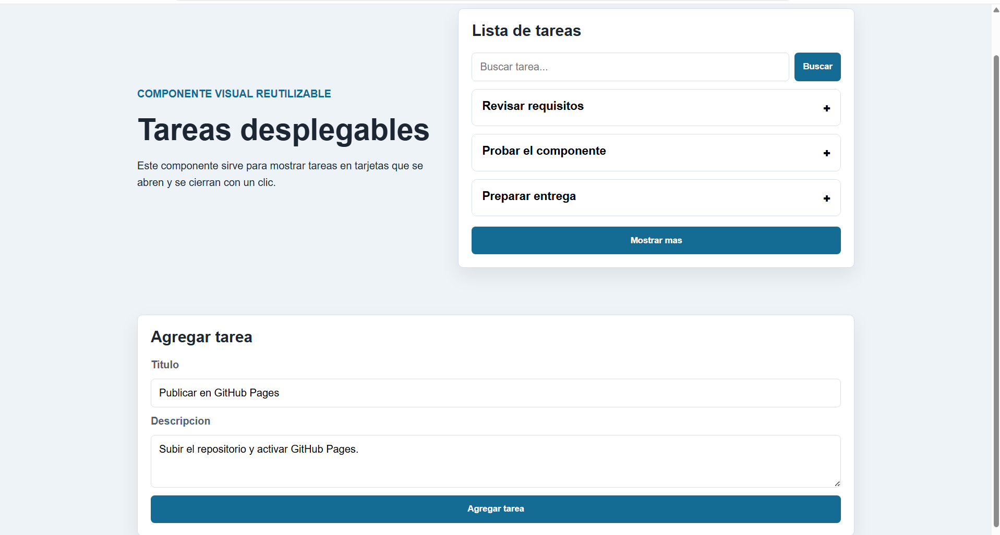
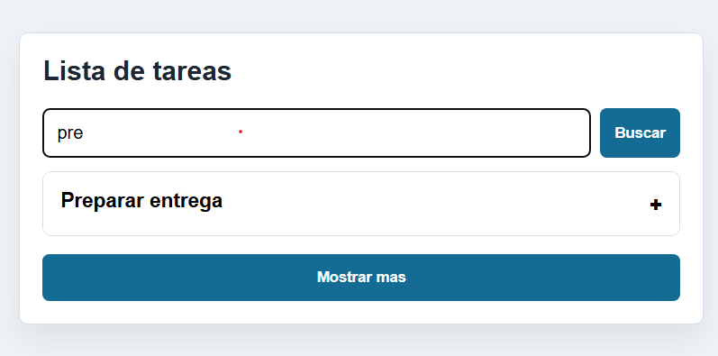
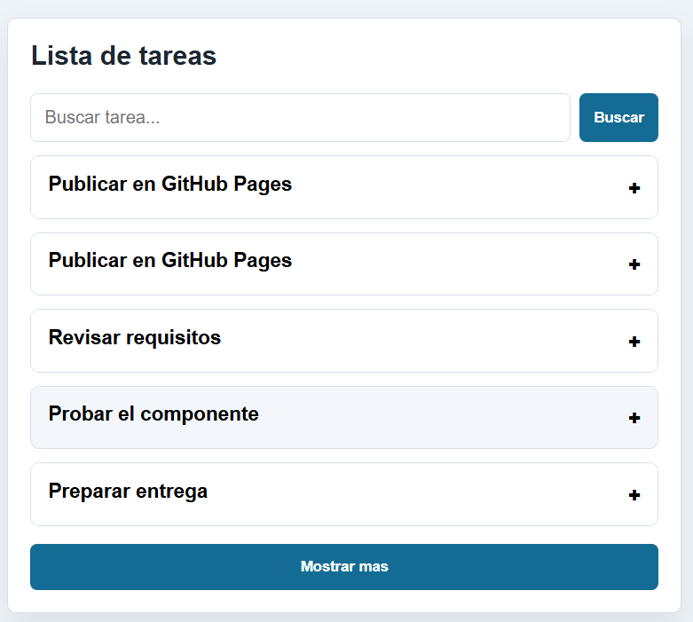

<div align="center">

TECNOLOGICO NACIONAL DE MEXICO  
INSTITUTO TECNOLOGICO DE OAXACA  
Departamento de Ingenieria en Sistemas Computacionales


Materia: Programacion Web  
Actividad: Actividad 3. Componente visual reutilizable  

Docente: Martinez Nieto Adelina  
Grupo: 7SD  
Alumno: Valencia Borja Omar Rutilio  
Numero de control: 22161258  

Oaxaca, Oaxaca, 04 de Julio de 2026

</div>

# Tareas Desplegables

## Nombre del componente

**TareasDesplegables**

## Que problema resuelve

Este componente ayuda a mostrar varias tareas, pasos o instrucciones sin llenar toda la pantalla de texto. Cada tarea aparece como una tarjeta visual que el usuario puede abrir y cerrar con un clic.

Tambien incluye busqueda, boton de **Mostrar mas** y un formulario para agregar nuevas tareas. Las tareas nuevas aparecen arriba para que se vean primero.

## Instalacion

Para usar esta libreria en una pagina HTML se deben incluir dos archivos del proyecto: el CSS para los estilos visuales y el JavaScript para el comportamiento interactivo.

El archivo CSS se coloca dentro de la etiqueta `<head>` para que las tarjetas tengan diseno:

```html
<link rel="stylesheet" href="css/componente.css">
```

El archivo JavaScript se coloca antes de cerrar el `<body>` para que el navegador cargue primero el HTML y despues active el componente:

```html
<script src="js/componente.js"></script>
```

Ejemplo de estructura basica:

```html
<!DOCTYPE html>
<html lang="es">
<head>
  <meta charset="UTF-8">
  <title>Demo</title>
  <link rel="stylesheet" href="css/componente.css">
</head>
<body>
  <div id="lista-tareas"></div>

  <script src="js/componente.js"></script>
</body>
</html>
```

## Uso

Primero se agrega un contenedor en el HTML. Dentro de este contenedor se van a generar las tarjetas del componente:

```html
<div id="lista-tareas"></div>
```

Despues se crea una instancia de `TareasDesplegables`. El primer parametro es el selector del contenedor y el segundo parametro es la lista de tareas que se desea mostrar:

```html
<script src="js/componente.js"></script>
<script>
  const tareas = new TareasDesplegables('#lista-tareas', [
    {
      titulo: 'Revisar requisitos',
      descripcion: 'Confirmar que el proyecto tenga HTML, CSS, JS y README.'
    },
    {
      titulo: 'Probar el componente',
      descripcion: 'Abrir y cerrar las tarjetas para revisar la interaccion.'
    }
  ]);
</script>
```

Cada tarea necesita dos datos:

```js
{
  titulo: 'Nombre de la tarea',
  descripcion: 'Texto que se muestra al abrir la tarjeta.'
}
```

## Agregar una tarea nueva

El metodo `agregar` permite insertar una nueva tarea sin modificar el HTML. La nueva tarea aparece al inicio de la lista:

```js
tareas.agregar(
  'Publicar en GitHub Pages',
  'Subir el repositorio y activar GitHub Pages.'
);
```

## Buscar tareas

El metodo `buscar` filtra las tareas por texto. En la pagina tambien se usa con el campo de busqueda:

```js
tareas.buscar('github');
```

## Mostrar mas tareas

Para que la lista no crezca demasiado en pantalla, el componente muestra pocas tareas al inicio. Con `mostrarMas` se cargan mas tarjetas:

```js
tareas.mostrarMas();
```

## Ejemplo completo

```html
<!DOCTYPE html>
<html lang="es">
<head>
  <meta charset="UTF-8">
  <link rel="stylesheet" href="css/componente.css">
  <title>Demo de tareas</title>
</head>
<body>
  <div id="lista-tareas"></div>

  <script src="js/componente.js"></script>
  <script>
    const tareas = new TareasDesplegables('#lista-tareas', [
      {
        titulo: 'Revisar requisitos',
        descripcion: 'Leer las instrucciones de la actividad.'
      },
      {
        titulo: 'Subir repositorio',
        descripcion: 'Publicar el proyecto en GitHub.'
      }
    ]);

    tareas.agregar('Grabar video', 'Hacer una demo de maximo 1 minuto.');
  </script>
</body>
</html>

```

### Componente funcionando

Esta imagen debe mostrar la pagina con las tarjetas desplegables funcionando. Se recomienda abrir una tarea para que se vea el contenido interno:



### Busqueda de tareas

Esta captura debe mostrar el buscador con una palabra escrita y el resultado filtrado:



### Consola

Esta captura sirve para comprobar que el componente no genera errores de JavaScript. Abre las herramientas del navegador, entra a la pestana `Console` y toma una captura despues de usar el componente:



## Video demo

El video debe durar maximo 1 minuto y debe explicar el componente como una demostracion breve. La idea es mostrar el problema, el uso y el resultado funcionando.

link del video:

## Conclusion

Con esta actividad se desarrollo un componente visual interactivo usando HTML, CSS y JavaScript puro, sin frameworks. El componente permite organizar tareas en tarjetas desplegables, buscar contenido, mostrar mas resultados y agregar nuevas tareas desde un formulario.

La libreria es reutilizable porque puede insertarse en otra pagina HTML y recibir diferentes tareas desde JavaScript, sin modificar la estructura interna del componente. Esto cumple con el objetivo de crear una pieza visual que el usuario puede ver, usar e integrar en distintos proyectos.
